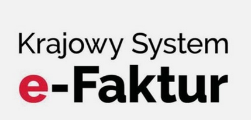

# KSEF for Dolibarr ERP CRM

## [Po Polsku](README_PL.md)

## Description

This module integrates Dolibarr with KSEF (Krajowy System e-Faktur / National e-Invoice System), the Polish electronic
invoicing system.

## Features

- Generation of FA(3) XML
- Signing and submission of FA(3) XML invoices to KSeF
- Download of UPO (Recept of submission)
- Automatic addition of QR code to PDF invoice
- Can exclude 3rd parties from KSeF (e.g. generic B2C third parties)
- Adds KSeF Fields (including clickable KSeF number and submission status to verify submission) to main invoice page
- Adds page with overview of all submissions, as well as KSeF tab to invoice page

## Requirements

### System Requirements

- Dolibarr: As of 02 Dec 25 only tested on v22.0.3
- PHP: 7.4 or higher
- PHP Extensions:
    - `OpenSSL`
    - `cURL`
    - `DOM`
- Dolibarr Barcode Module: for generating QR codes on PDFs

### KSEF Account

- A valid Polish NIP (tax identification number) configured in your company settings.
- An active KSEF account with an authorization token generated from the official KSEF portal for your chosen
  environment (Test or Production).

## Installation

The recommended installation method is from a ZIP file.

1. Download the latest module ZIP file from the release page
2. In Dolibarr, go to Home → Setup → Modules/Applications
3. Select the Deploy/install external module tab
4. Upload the module's ZIP file
5. Find the KSEF Integration module in the list and enable it

## Contributing

Feel free to fork this module or contribute a PR to help improve the Dolibarr community

Build instructions can be found in the developer readme [DEV.md](DEV.md)

## Roadmap

- [ ] Add KSeF exclusion to Third Party tabs (https://www.dolibarr.org/forum/t/ksef-module-for-dolibarr/30788/9)
- [ ] FA(3) builder is yet not complete for some edge cases
- [ ] Offline24 mode handling is missing, and it does not generate the Offline QR Codes yet
- [ ] Fix php-scoper issues with phpseclib

## Licenses

### Main code

This project is licensed under the AGPLv3+

See [LICENSE](LICENSE) file for details.

### Third-Party Libraries

This module currently includes the following third-party libraries in the `lib/vendor` directory:

- [phpseclib/phpseclib](https://github.com/phpseclib/phpseclib) - MIT License - Used for API authentication and invoice
  encryption

- [paragonie/constant_time_encoding](https://github.com/paragonie/constant_time_encoding) - MIT License - Used by
  phpseclib

- [composer](https://github.com/composer/composer) - MIT License - Composer files are currently vendor directory until
  scoping is fixed and are not used at runtime

> Dependencies are currently unscoped and distributed as-is from Composer. Future versions will
> use [humbug/php-scoper](https://github.com/humbug/php-scoper) to scope dependencies

## Legal Notice

This module is not officially endorsed by or affiliated with:

- The Polish Ministry of Finance
- The KSeF (Krajowy System e-Faktur) system operators

Use of this module does not guarantee compliance with Polish tax regulations. Users are responsible for ensuring their
invoicing practices comply with current Polish law.

## Credits

Thanks to Éric Seigne and the FacturX plugin (https://registry.inligit.fr/cap-rel/dolibarr/plugin-facturx). Without
learning from their module, this project would have taken ages longer to complete

This module was developed by InPoint Automation Sp. z o.o.
